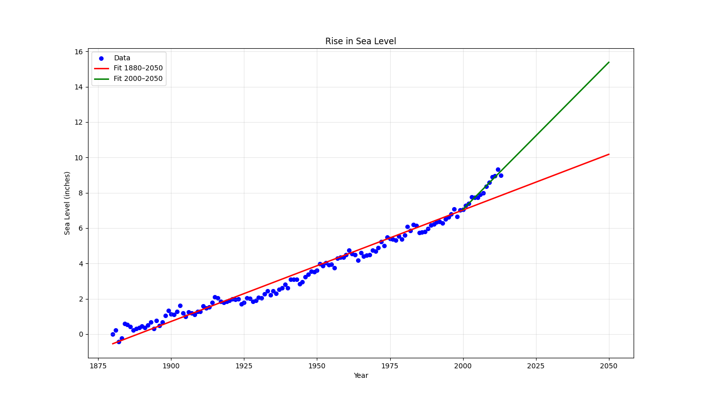

# Sea Level Predictor  

## Project Overview
Analyzed EPA global sea level data (1880–present) and created a **linear regression visualization** with two trend lines:
- Full dataset (1880–2050)
- Recent period (2000–2050) → shows **acceleration** in sea level rise

## Visualization

## Key Insights
- Sea level has risen ~240 mm since 1880
- Rate of rise is **accelerating** in recent decades
- If current trend continues, sea level will rise **~400 mm by 2050**

## Live Notebook
[Run & Explore on Google Colab](https://colab.research.google.com/drive/1NkC1SSlBgcrlFmCJ7DFvH6ctDlGHw6TA?usp=sharing)

## Files
- `sea_level_predictor.ipynb`
- `epa-sea-level.csv`
- `sea_level_plot.png`

## Skills Demonstrated
- Linear regression with SciPy
- Dual trend line analysis
- Climate data visualization
- Predictive modeling

---

## Connect with Me

**Made with love by Abishek**

Now go update your LinkedIn and celebrate!

Whenever you want to start **Machine Learning with Python** next… just say the word. I’m ready when you are.
